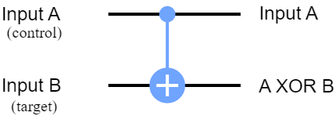

# This file contains notes for the [IBM course on QC](https://qiskit.org/learn/)

## Course: Introduction to Quantum Computing

### Why Quantum Computing

- At a very simple level, there are two factors that limit the size of problems our quantum computers can solve. The first is the amount of data they can store and work on, which we usually measure in qubits. If we don’t have enough qubits, we simply can’t store and operate on problems above a certain size. The second is the error rate of our quantum computer. The quantum computers we have right now are noisy, which means they often get things wrong and introduce noise (Noise is useless information that's difficult to distinguish from useful information.) into our results.

### The Atoms of Computation

- In a circuit, we typically need to do three jobs: First, encode the input, then do some actual computation, and finally extract an output.

```python
from qiskit import QuantumCircuit
# Create quantum circuit with 3 qubits and 3 classical bits
# (we'll explain why we need the classical bits later)
qc = QuantumCircuit(3, 3)
qc.draw()  # returns a drawing of the circuit
```

- Way to tell quantum computer to measure qubits and record the results.

```python
from qiskit import QuantumCircuit
qc = QuantumCircuit(3, 3)
# measure qubits 0, 1 & 2 to classical bits 0, 1 & 2 respectively
qc.measure([0,1,2], [0,1,2])
qc.draw()
```

- Quantum Simulator is a standard computer calculating what an ideal quantum computer would do. Simulating a quantum computer is difficult for classical computers, as the best algorithms grow exponentially with the number of qubits. As such, these simulations are only possible for circuits with small numbers of qubits (up to ~30 qubits), or certain types of circuits for which some tricks, to speed up the simulation, are available. Nevertheless, simulators are very useful tools for designing smaller quantum circuits. **Aer** is Qiskit’s simulator.

```python
from qiskit.providers.aer import AerSimulator
sim = AerSimulator()  # make new simulator object
job = sim.run(qc)      # run the experiment
result = job.result()  # get the results
result.get_counts()    # interpret the results as a "counts" dictionary
```

- The keys in counts dictionary are bit-strings, and the values are the number of times that bit-string was measured. Quantum computers can have randomness in their results, so it's common to repeat the circuit a few times (default: 1024).

- The X-gate is equivalent to the NOT-gate.

- ‘controlled-NOT gate’ is equivalent to the XOR-gate. This is applied to a pair of qubits. One acts as the control qubit (this is the one with the little dot). The other acts as the target qubit (with the big circle and cross - kind of like a target mark).
  

```python
# Create quantum circuit with 2 qubits and 2 classical bits
qc = QuantumCircuit(2, 2)
qc.x(0)
qc.cx(0,1)  # CNOT controlled by qubit 0 and targeting qubit 1
qc.measure([0,1], [0,1])
display(qc.draw())     # display a drawing of the circuit

job = sim.run(qc)      # run the experiment
result = job.result()  # get the results
# interpret the results as a "counts" dictionary
print("Result: ", result.get_counts())
```

- The Toffoli-gate is equivalent to the AND-gate.

- The following is the half-adder in QC:

```python
test_qc = QuantumCircuit(4, 2)

# First, our circuit should encode an input (here '11')
test_qc.x(0)
test_qc.x(1)

# Next, it should carry out the adder circuit we created
test_qc.cx(0,2)
test_qc.cx(1,2)
test_qc.ccx(0,1,3)

# Finally, we will measure the bottom two qubits to extract the output
test_qc.measure(2,0)
test_qc.measure(3,1)
test_qc.draw()

job = sim.run(test_qc)  # run the experiment
result = job.result()   # get the results
result.get_counts()     # interpret the results as a “counts” dictionary
```

### What is quantum?

- How to make a bit in the real world?

  - **Punched cards**: In the early days of computing, computer scientists stored bits by making holes in paper cards. These cards were divided into grids, and each cell in the grid represents a bit. If there is a hole in that cell, the bit is '1', if no hole, the bit is '0'. If you want to change the value of a bit, you can either punch a new hole, or patch (Changing a computer program to fix a problem is known as 'patching' it.) the hole back up.
  - **Electron orbitals**: Electrons orbit the center (nucleus) of an atom and can only orbit at specific quantized (When something is 'quantized', it is constrained to a set of specific values.) distances from the nucleus which are shells (An electron shell is an orbit an electron can follow around an atom's nucleus). If we have a way of detecting which shell an electron is in, we can pick two of these shells and use the location of the electron as a bit. If the electron is in one of these shells, the bit is '0', and if it is in the other, the bit is '1'.

- “What if our bits followed the rules of quantum physics instead of classical physics?”. We call these bits “qubits” for “quantum bit”, and computers that can operate on these bits are called “quantum computers”.

- Probabilities work extremely well for things we usually see in the world around us, but with "quantum" things (like qubits), this approach fails. What’s the solution? To describe quantum mechanics, we can use probability amplitudes. Probability amplitudes are similar to normal probabilities in that:

  - amplitudes have a magnitude,
  - each possible outcome has a probability amplitude,
  - and the magnitude of that outcome's amplitude tells us how likely that outcome is to occur.

- But amplitudes also have an extra property which we call phase (For our purposes, 'phase' is simply an angle that tells us which way our amplitudes are pointing). So whereas conventional probabilities only have a magnitude, amplitudes also have a direction. The result of phase is that, when we add two of these amplitudes together, they can cancel each other out, just like positive and negative numbers do. This behaviour is called interference and explains all the behaviour specific to quantum mechanics that we don’t see in classical mechanics.

- With the amplitude model, we can’t say the qubit took a specific route because we wouldn’t see the interference effect. This leads people to say things like “the qubit can be and at the same time!”, which isn’t necessarily an incorrect way to describe the behaviour of the qubit, but also isn’t especially useful to people learning about quantum computing.

- The best algorithms we have for simulating qubits use exponential resources with the number of qubits, so simulating large numbers of qubits is out of reach for classical computers.

### Describing Quantum Computers

- Computational Basis: all other vectors can be written as the linear combination of computational basis.
- Another factor is something we call "global phases" of state vector. Since we only know phase exists because of the interference effects it produces, we can only ever measure phase differences. If we rotated all the amplitudes in a state vector by the same amount, we'd still see the exact same behaviour. For example, there is no experiment we could perform that would be able to distinguish between these two states:
  $$
  \ket{a} = \sqrt{\frac{1}{2}}\begin{bmatrix}
             1 \\
             0 \\
             0 \\
             1
           \end{bmatrix}
           \quad
    -\ket{a} = \sqrt{\frac{1}{2}}\begin{bmatrix}
             -1 \\
              0 \\
              0 \\
             -1
           \end{bmatrix}
  $$
- Because the differences between each of the amplitudes is the same. You could say these two vectors are different mathematically, but the same physically.

- The way there is a transition probability to transform a coin from tails to heads, there is a amplitude transition for each starting and end state of qubits. Any quantum operation can be described through these transition amplitudes.

- So, what possible transformations are there? Say we have a starting state $\ket{a}$ that’s transformed to a new state $\ket{b}$. If we want our representation to cover every possible transformation, then each amplitude in $\ket{a}$ must have a transition amplitude to each amplitude in $\ket{b}$. For an $n$ qubit system, the largest number of transition amplitudes we need to represent an quantum operation is $(2^n)^2$.

- In the same way that not every vector is a valid state vector, not every matrix is a valid quantum operation. So when does a matrix a valid quantum operation? When the matrix is reversible, this is to preserve the probability in all cases. Reversibility means that the operations can be performed in backward to undo the effects. These matrices are called **Unitary** matrices.

### Entangled Gates

- In Qiskit code, qubits and bits are indexed from $0$ and numbered from right to left. So for $\ket{1000}$, the four qubits are numbered $0$, $1$, $2$, and $3$. It is qubit $3$ that is in state $\ket{1}$, while the rest are in state $\ket{0}$. This is by design, so that the qubit's index is also the power of $2$ it represents.

- **Product State** can be written as a sequence of single qubit states, while **Entangled State** cannot.
- Quantum computations typically start in a product state. Specifically, where all qubits are in the state $\ket{0}$. To create entanglement, we need to apply multi-qubit gates. The most prominent of these are controlled gates, with the **cx** (performs an X-gate on the target qubit only if the control qubit is 1) and **cz** (performs a Z-gate on the target qubit only if the control qubit is 1) gates being the simplest examples.

```python
from qiskit import QuantumCircuit
from qiskit.quantum_info import Statevector

qc = QuantumCircuit(2)

# This calculates what the state vector of our qubits would be
# after passing through the circuit 'qc'
ket = Statevector(qc)

# The code below writes down the state vector.
# Since it's the last line in the cell, the cell will display it as output
ket.draw()

qc.cx(0,1)

ket = Statevector(qc)
ket.draw()
# see the test.py
```

- Entanglement is a necessary ingredient of any quantum advantage, otherwise for `n` qubits one would need only `2n` amplitude which can be easily simulated on the classical computers. Another application of entanglement can be seen in Quantum Communication (see the section [Qubits working together: Superdense coding](https://learn.qiskit.org/course/introduction/entangled-states#entangled-40-0)).

### Measuring a Qubit

- The only information we extract from a qubit is through measurement: We apply the measure operation and get back a `0` or a `1` (these are classical values, i.e. deterministic). For some types of qubit, it's possible to rotate the measurement device to do different kinds of measurement, and see different behavior from the results (`Standard Measurement` or `z-measurement`). For other kinds of qubit, rotating your measurement device will just break it. Therefore, just rotate the qubit instead! By performing single qubit gates before making a standard measurement, we reproduce the effects of these alternative forms of measurement (`x-measurement`).

```python
#x-measurement
meas_x = QuantumCircuit(1,1)
meas_x.h(0)
meas_x.measure(0,0)

# meas_x.draw()

# standard or z-measurement
meas_z = QuantumCircuit(1,1)
meas_z.measure(0,0)

# meas_z.draw()

# another example
qc = QuantumCircuit(1,1)
qc.h(0)

qc.draw()

for basis,circ in [('z', meas_z), ('x', meas_x)]:
    print('Results from ' + basis + ' measurement:',
      backend.run(qc.compose(circ)).result().get_counts())
```

### The uncertainty principle

- All of the results above are the consequence of the uncertainty principle.
- These are two different ways to encode a bit of information in a qubit. The normal way, using the $\ket{0}$ and $\ket{1}$ states to encode the bit values `0` and `1` and using the `z measurement` to read it out. Or, using the $\ket{+}$ and $\ket{-}$ states to encode the bit values and the `x measurement` for read out. But the uncertainty principle makes sure that both can't be done at once. Specifically, for the z measurements a quantity $$\langle Z \rangle = p_z(0) - p_z(1)$$ can be defined where $\langle Z \rangle$ is the expectation value of a `z measurement` and $p_z$ is the probability of measuring `0` or `1` with a `z measurement`.

- This quantity reaches its maximum value of `1` for a state that is certain to output `0`, and its minimum value of `-1` for a state certain to output `1`. Note that in both of these cases where the output is certain, $\langle Z \rangle^2  = 1$. For a completely random result, however, we would find $\langle Z \rangle = \langle Z \rangle^2 = 0$.

- The quantity $\langle X \rangle$ for the outcomes of `x measurements` can similarly be defined. For these the following holds: for any valid state vector $$\langle X \rangle^2 + \langle Z \rangle^2 \leq 1$$. This is the uncertainty principle for a qubit, specifically how much certainty can be shared between these kinds of measurement.
