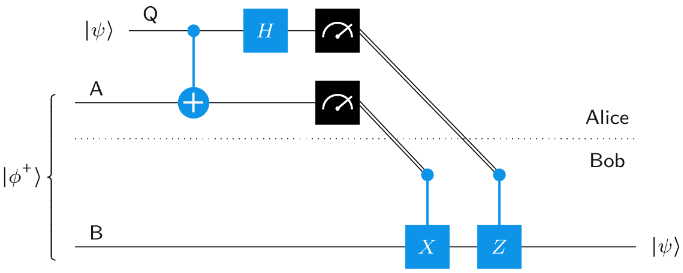
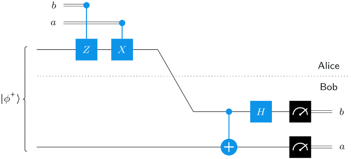

## Basics of quantum information

### Single Systems

- There are two common mathematical descriptions of quantum information. The one introduced in this lesson is the simpler of the two.
- A more general, and ultimately more powerful description of quantum information, in which quantum states are represented by density matrices, will be introduced in a later lesson. The density matrix description is essential to the study of quantum information as they can be used to model the effects of **noise** (In the context of information, noise refers to unwanted disturbances or alterations, which may be caused by imperfect hardware or uncontrollable factors in the environment. As an example phrased in mathematical terms, a bit in a computer memory that spontaneously flips with some probability could be described as being noisy.) on quantum computations, or the state of one piece of an entangled pair. More generally, density matrices serve as a mathematical basis for quantum information theory and quantum cryptography.

#### Classical Information
- Let $X$ be the classical system being considered, let $\Sigma$ be the set of the classical states of $X$. The classical state set is assumed to be finite and non-empty.
- We represent our knowledge of the classical state of $X$ by assigning probabilities to each classical state, resulting in a _probabilistic state_. For example, suppose $X$ is a bit and based on what we know or expect the following is the probability of $0$ and $1$: $$Pr(X=0) = \frac{3}{4} \quad and \quad Pr(X=1) = \frac{1}{4}$$ This can be represented by column vector: $$\begin{pmatrix} \frac{3}{4} \\\\ \frac{1}{4}\end{pmatrix}$$

- We can represent any probabilistic state through a column vector satisfying two properties:
    1. All entries of the vector are _nonnegative real numbers_.
    2. The sum of the entries is equal to 1.
- Conversely, any column vector that satisfies these two properties can be taken as a representation of a probabilistic state. We will refer to vectors of this form as _probability vectors_.

- By measuring a system, we mean that we look at the system and unambiguously recognize whatever classical state it is in. Measurement does not change the state, but only our knowledge of it.
- Measurement changes our knowledge of the system, and therefore changes the probabilistic state that we associate with that system: if we recognize that $X$ is in the classical state $a \in \Sigma$, then the new probability vector representing our knowledge of $X$ becomes a vector having a $1$ in the entry corresponding to $a$ and $0$ for all other entries. This vector indicates that $X$ is in the classical state $a$ with certainty, which we know having just recognized it. This vector is represented by $\ket{a}$.
- If the system is that of bit then the following represents the _standard basis vectors_ $$\ket{0} = \begin{pmatrix} 1 \\\\ 0 \end{pmatrix} \quad \ket{1} = \begin{pmatrix} 0 \\\\ 1 \end{pmatrix}$$

- **Deterministic operation**: An operation is deterministic if the result is completely determined by the input without any element of chance or uncertainty.
- The actions of deterministic operations on probabilistic states can be represented by matrix-vector multiplication. Specifically, the matrix $M$ that represents a given function $f:\Sigma \to \Sigma$ is the one that satisfies: $$M\ket{a} = \ket{f(a)}$$ for every $a \in \Sigma$. Such a matrix always exists and is unique.

- $\bra{a}$ denotes the row vector. For example, if $\Sigma = \{0,1\}$, then $$\bra{0} = (1 \quad 0) \quad and \quad \bra{1} = (0 \quad 1)$$

- $\ket{0}\bra{1}$ is a matrix multiplication. 
- Using this notation, for any function $f:\Sigma \to \Sigma$, we may express the matrix $M$ corresponding to the function $f$ as $$M = \sum_{a\in \Sigma}\ket{f(a)}\bra{a}$$
- $\braket{a|b}$ represents the inner product between the vectors. 
$$\braket{a|b} = \begin{cases} 
        1, & a = b \\
        0, & a \neq b
    \end{cases}
$$

- Using this observation, we obtain: $$M\ket{b} = \left(\sum_{a\in \Sigma}\ket{f(a)}\bra{a}\right) \ket{b} = \sum_{a\in \Sigma}\ket{f(a)}\braket{a|b} = \ket{f(b)}$$ for each $b \in \Sigma$

- For an arbitrary choice of a classical state set, we can describe the set of all *probabilistic operations* in mathematical terms as those that are represented by stochastic matrices, which are matrices satisfying these two properties:
    1. All entries are nonnegative real numbers.
    2. The entries in every column sum to 1.
- *Stochastic matrices* are matrices whose columns all form probability vectors. With respect to the stochastic matrix description of a probabilistic operation, each column can be viewed as a vector representation of the probabilistic state that is generated given whatever classical state input corresponds to that column.
- Stochastic matrices always map probability vectors to probability vectors, and any matrix that always maps probability vectors to probability vectors must be a stochastic matrix.
- Another way to think about probabilistic operations is that they are random choices of deterministic operations. This means that for an arbitrary choice of a classical state set and any stochastic matrix with rows and columns identified with that classical state set, it is possible to write the stochastic matrix in terms of classical state set. (read the documentation if you don't understand)

- Suppose that $X$ is a system having classical state set $\Sigma$, and $M_1,...,M_n$ are stochastic matrices representing probabilistic operations on the system $X$. Then $$M_2(M_1u) = (M_2M_1)u$$ and $M_2M_1$ is stochastic.

#### Quantum Information
- A *quantum state* of a system is represented by a column vector. Vectors representing quantum states are characterized by these two properties:
    1. The entries of a quantum state vector are complex numbers.
    2. The sum of the absolute values squared of the entries of a quantum state vector must equal 1.
- Quantum state vectors are _unit vectors with respect to the Euclidean norm_.

- The term qubit refers to a quantum system whose classical state set is $\{0,1\}$. That is, a _qubit is really just a bit_ — but by using this name we explicitly recognize that this bit can be in a quantum state.

- We associate the quantum state vectors $\ket{0}$ and $\ket{1}$ with a qubit being in the classical state 0 or 1, respectively, with certainty.

- Within the context of quantum states, "superposition" and "linear combination" are essentially synonymous.

- If $\Sigma = \{0,1\}$ and $\ket{\psi} = a\ket{0} + b\ket{1}$ is a vector whose indices correspond to $\Sigma$ then $\braket{0|\psi} = a$.

- $\bra{\psi}$ refers to the row vector obtained by taking the conjugate-transpose of the column vector $\ket{\psi}$.

- When a system in a quantum state is measured, the observer performing the measurement won't see a quantum state vector, but rather some classical state. In this sense, measurements act as the interface between quantum and classical information, through which classical information is extracted from quantum states.

- The rule is simple: if a quantum state is measured, each classical state of the system results with probability equal to the absolute value squared of the entry in the quantum state vector corresponding to that classical state. This is known as the **Born rule** in quantum mechanics.

- When a quantum state is measured, the probability to obtain each classical state is given by the absolute value squared of the corresponding vector entry — so why not simply record these probabilities in a probability vector? The answer, at least in part, is that the set of allowable operations that can be performed on a quantum state is different than it is for classical information. Similar to the probabilistic setting, operations on quantum states are linear mappings — but rather than being represented by stochastic matrices as in the classical case, operations on quantum state vectors are represented by unitary matrices.

- A square matrix $U$ having complex number entries is **unitary** if it satisfies the equations $$UU^\dagger = \mathbb{1} \\ U^\dagger U = \mathbb{1}$$ $U^\dagger$ is _conjugate transpose_ of $U$. If either of the equalities in the equation above is true, then the other must also be true; both equalities are equivalent of $U^\dagger$ being the inverse of $U$: $$U^{-1} = U^\dagger$$

- The condition that $U$ is unitary is equivalent to the condition that multiplication by $U$ does not change the Euclidean norm of any vector. That is, an $n\times n$ matrix $U$ is unitary if and only if $||U\ket{\psi}|| = ||\ket{psi}||$ for every $n$-dimensional column vector $\ket{\psi}$ with complex number entries. Thus, because the set of all quantum state vectors is the same as the set of vectors having Euclidean norm equal to $1$, multiplying a unitary matrix to a quantum state vector results in another quantum state vector.

- Consider a situation in which a qubit is prepared in one of the two quantum states $\ket{+}$ and $\ket{-}$, but where it is not known to us which one it is. Measuring either state produces the same output distribution as the other. In this case Hadamard gate can perfectly separate the quantum state as it changes the phases. $$H\ket{0} = \ket{+} \\ H\ket{1} = \ket{-} \\ H\ket{+} = \ket{0} \\ H\ket{-} = \ket{1}$$

- **Permutation matrix**: a matrix in which every row and column has exactly one $1$. Such matrices only rearrange, or permute, the entries of the vector it acts on. The identity is the simplest permutation matrix; another example is the NOT operation on a bit or qubit. Every permutation matrix, in any positive integer dimension, is unitary. These are the only examples of matrices that represent both classical and quantum operations: a matrix is both stochastic and unitary if and only if it is a permutation matrix.

### Multiple System

#### Combining classical systems
- Let us suppose that $X$ is a system whose classical state set is $\Sigma$, and $Y$ is a second system having classical state set $\Gamma$. The set of classical states of $(X,Y)$ is the Cartesian product of $\Sigma$ and $\Gamma$.

- To express **independence** in terms of probability vectors, assume that the given probabilistic state of $(X,Y)$ is described by a probability vector, written in the Dirac notation as $$\sum_{(a,b) \in \Sigma \times \Gamma}p_{ab}\ket{ab}$$ The condition for independence is then equivalent to the existence of two probability vectors $$\ket{\psi} = \sum_{a \in \Sigma} q_{a}\ket{a} \quad and \quad \ket{\psi} = \sum_{b \in \Gamma}r_{b}\ket{b}$$ representing the probabilities associated with the classical states of $X$ and $Y$, resp, such that $$p_{ab} = q_a r_b$$ for all $a \in \Sigma$ and $b \in \Gamma$. (read the example from the documentation)

- Correlation is lack of independence.

- Given two vectors $$\ket{\psi} = \sum_{a \in \Sigma} \alpha_{a}\ket{a} \quad and \quad \ket{\psi} = \sum_{b \in \Gamma}\beta_{b}\ket{b}$$ the tensor product $\ket{\phi} \otimes \ket{\psi}$ is a new vector over the joint state set $\Sigma \times \Gamma$, defined as $$\ket{\phi} \otimes \ket{\psi} = \sum_{(a,b) \in \Sigma \times \Gamma} \alpha{_a} \beta{_b}\ket{ab}.$$ Equivalently, the vector $\ket{\pi} = \ket{\phi} \otimes \ket{\psi}$ is defined by the equation $$\braket{ab|\pi} = \braket{a|\phi}\braket{b|\psi}.$$ being true for every $a \in \Sigma$ and $b \in \Gamma$.

- We can now recast the condition for independence as requiring the probability vector $\ket{\pi}$ of the joint system $(X,Y)$ to be representable as a tensor product $$\ket{\pi} = \ket{\phi} \otimes \ket{\psi}$$ of probability vectors $\ket{\phi}$ and $\ket{\psi}$ on each of the subsystems $X$ and $Y$. In this situation it is said that $\ket{\psi}$ is a **product state** or _product vector_.

- **Bilinear** is the property of the tensor product of two vectors, which means that it is linear in each of the two arguments separately, assuming that the other argument is fixed. This property can be expressed through these equations:
    1. Linearity in the first argument: $$(\ket{\phi_1} + \ket{\phi_2}) \otimes \ket{\psi} = \ket{\phi_1} \otimes \ket{\psi} + \ket{\phi_2} \otimes \ket{\psi} \\ (\alpha \ket{\phi}) \otimes \ket{\psi} = \alpha (\ket{\phi} \otimes \ket{\psi}) $$
    2. Linearity in the second argument: $$\ket{\phi} \otimes (\ket{\psi_1} + \ket{\psi_2}) = \ket{\phi} \otimes \ket{\psi_1} + \ket{\phi} \otimes \ket{\psi_2} \\ \ket{\phi} \otimes (\alpha \ket{\psi}) = \alpha (\ket{\phi} \otimes \ket{\psi}) $$

- This all can be extended to more than 3 dimensions. Bilinear becomes mutlilinear.

- Measurements of probabilitic states of multiple systems is simply an extension single system when one measures all the qubits. Things are different when one decides to measure a subset of multiple system. Let us suppose that $X$ is a system having classical state set $\Sigma$, that $Y$ is a system having classical state set $\Gamma$, and the two systems together are in some probabilistic state. We will consider what happens when we just measure $X$ and do nothing to $Y$. Since we are measuring just the $X$, we need to preserve the uncertainty of $Y$ which is what _conditional probability_ does. $$Pr(Y=b|X=a) = \frac{Pr((X,Y) = (a,b))}{Pr(X=a)}.$$

- To express these formulas in terms of probability vectors, consider a probability vector $\ket{\psi}$ describing the joint state of $(X,Y)$ $$\ket{\psi} = \sum_{(a,b) \in \Sigma \times \Gamma} p_{ab} \ket{ab}$$. The vector representing the probabilistic state of $X$ alone is given by $$\sum_{a \in \Sigma}\left(\sum_{c \in \Gamma}p_{ac}\right)\ket{a}.$$ Having obtained a particular outcome $a \in \Gamma$ of the measurement of $X$, the probabilistic state of $Y$ is updated according to the formula for conditional probabilities, so that it is represented by this probability vector: $$\ket{\pi _a} = \frac{\sum_{b \in \Gamma}p_{ab}\ket{b}}{\sum_{c \in \Gamma}p_{ac}}.$$ Read the example in the documentation to understand.

- The **tensor product of the matrices** $$ M = \sum_{a,b \in \Sigma}\alpha_{ab}\ket{a}\bra{b} $$ and $$ N = \sum_{c,d \in \Gamma}\beta_{cd}\ket{c}\bra{d} $$ is the matrix $$ M \otimes N = \sum_{a,b \in \Sigma}\sum_{c,d \in \Gamma}\alpha_{ab}\beta_{cd}\ket{ac}\bra{bd}.$$ An alternative, but equivalent, way to describe $M \otimes N$ is that it is the unique matrix that satisfies the equation $$ (M \otimes N)(\ket{\phi} \otimes \ket{\psi}) = (M\ket{\phi}) \otimes (N\ket{\psi}) $$ for every possible choice of vectors $\ket{\phi}$ and $\ket{\psi}$.

- The tensor product of matrices is sometimes said to be _multiplicative_ because the equation $$ (M_1 \otimes ... \otimes M_n)(N_1 \otimes ... \otimes N_n) = (M_1 N_1) \otimes ... \otimes (M_nN_n) $$ is always true, for any choice of matrices $M_1,...,M_n$ and $N_1,...,N_n$, provided that the products $M_1N_1,...,M_nN_n$ make sense.

- To summarize the above discussion, we found that if $M$ is a probabilistic operation on $X$, $N$ is a probabilistic operation on $Y$, and the two operations are performed independently, then the resulting operation on the compound system $(X,Y)$ is the tensor product $M \otimes N$. What we see, both classical and for probabilistic states, is that _tensor products represent independence_: if we have two systems $X$ and $Y$ that are independently in the probabilistic states $\ket{phi}$ and $\ket{pi}$, then the compound system $(X,Y)$ is in the probabilistic state $\ket{phi} \otimes \ket{\pi}$; and if we independently apply probabilistic operations $M$ and $N$ to the two systems independently, then the resulting action on the compound system $(X,Y)$ is described by the operation $M \otimes N$. 

#### Quantum information

- Quantum states of multiple systems are represented by column vectors having complex number entries and Euclidean norm equal to 1 — just like quantum states of single systems. In the multiple system case, the indices of these vectors are placed in correspondence with the Cartesian product of the classical state sets associated with each of the individual systems.

- Tensor products of quantum state vectors are also quantum state vectors — and again they represent independence among systems.

- When a pair of systems $(X,Y)$ is in a product state $\ket{\phi} \otimes \ket{\psi}$, we may interpret this as meaning that $X$ is in the quantum state $\ket{\phi}$, $Y$ is in the quantum state $\ket{\psi}$, and the states of the two systems have nothing to do with one another.

- Not all quantum state vectors of multiple systems are product states. Quantum state vector can also represent a correlation between two systems, and specifically we say that the systems are _entangled_. Any quantum state vector that is not a product vector represents an entangled state.

- **Bell states** are the following four two-qubit states: $$\ket{\phi^+} = \frac{1}{\sqrt{2}}\ket{00} + \frac{1}{\sqrt{2}}\ket{11} \\ \ket{\phi^-} = \frac{1}{\sqrt{2}}\ket{00} - \frac{1}{\sqrt{2}}\ket{11} \\ \ket{\psi^+} = \frac{1}{\sqrt{2}}\ket{01} + \frac{1}{\sqrt{2}}\ket{10} \\ \ket{\psi^-} = \frac{1}{\sqrt{2}}\ket{01} - \frac{1}{\sqrt{2}}\ket{10}.$$ All four of the Bell states represent entanglement between two qubits. The collection of all four Bell states $$ \{ \ket{\phi^+}, \ket{\phi^-}, \ket{\psi^+}, \ket{\psi^-} \} $$ is known as the **Bell basis**; any quantum state vector of two qubits, or indeed any complex vector at all having entries corresponding to the four classical states of two bits, can be expressed as a linear combination of the four Bell states.

- _GHZ State_ represents a quantum of three qubits $(X,Y,Z)$: $$\frac{1}{\sqrt{2}}\ket{000} + \frac{1}{\sqrt{2}}\ket{111}$$ _W-State_: $$\frac{1}{\sqrt{3}}\ket{001} + \frac{1}{\sqrt{3}}\ket{010} + \frac{1}{\sqrt{3}}\ket{100}.$$ Both are example of entanglement in 3 qubits system.

- Systems having the classical state set $\{0,1,2\}$ are often called _trits_ or, assuming we consider the possibility that they are in quantum states, _qutrits_. The term _qudit_ refers to a system having classical state set $\{0,...,d-1\}$ for an arbitrary choice of $d$.

- When unitary operations are performed independently on a collection of individual systems, the combined action of these independent operations is described by the tensor product of the unitary matrices that represent them. (the probabilistic and quantum settings are analogous in this regard.)

- The tensor product of any collection of unitary matrices is unitary.

- The operation on $(X,Y)$ that is obtained when we perform $U$ on $X$ and do nothing to $Y$ is therefore represented by the unitary matrix $$U \otimes \mathbb{1}_Y$$ and vice-versa.

- Not every unitary operation on a collection of systems $X_1,...,X_n$ can be written as a tensor product of unitary operations $U_1 \otimes...\otimes U_n$, just as not every quantum state vector of these systems is a product state. For example, neither the swap operation nor the controlled-NOT operation on two qubits can be expressed as a tensor product of unitary operations.

- _SWAP Operation_: for every choice of classical states $a,b \in \Sigma$: $$SWAP\ket{a}\ket{b} = \ket{b}\ket{a}$$ Using Dirac notation (write the matrix associated) $$SWAP = \sum_{c,d \in \Sigma}\ket{c}\bra{d}\otimes\ket{d}\bra{c}.$$

- _Controlled-unitary operations_: For every unitary operation $U$ acting on the system $Y$, a controlled $U$ operation is a unitary operation on the pair $(X,Y)$ defined as follows: $$CU = \ket{0}\bra{0}\otimes \mathbb{1}_Y + \ket{1}\bra{1}\otimes U.$$ If $Y$ is a qubit and $X = \sigma _x$ (Pauli-x operation) then $CU$ becomes $CX$ and similarly $CZ$. If instead we take $Y$ to be two qubits, and we take $U$ to be the swap operation between these two qubits, we obtain _Fredkin operation_ (or _Fredkin Gate_). Its action on standard basis states can be described as follows: $$CSWAP\ket{0bc}  = \ket{0bc} \\ CSWAP\ket{1bc}  = \ket{1cb}$$

### Quantum circuits

#### Circuits
- In computer science, _circuits_ are models of computation in which information is carried by wires through a network of gates, which represent operations that transform the information carried by the wires. Quantum circuits are just one example of a model of computation. We usually study acyclic circuits when we're thinking about circuits as computational models.

- _Fanout operations_, which simply create a copy of whatever value is carried on the wire on which they appear, so that this value can be input into multiple gates. Fanout operations are not always considered to be gates in the classical setting but when we discuss how ordinary Boolean circuits can be converted into equivalent quantum circuits, we must classify fanout operations explicitly as gates.

- In _(classical) Boolean circuit_, the wires carry binary values and the gates represent Boolean logic operations. In the _quantum circuit model_, wires represent qubits and gates represent operations acting on these qubits.

- *Ordering of qubits in quantum circuits*: when we refer to the qubit in the zeroth position, we're referring to the topmost qubit in a circuit diagram or the rightmost qubit in the expression of a quantum state vector. This indexing convention is known as _little-endian indexing_.

-  In quantum circuits classical bit wires are indicated by double lines.

- The measurement gates represent standard basis measurements: the qubits are changed into their post-measurement states, while the measurement outcomes are overwritten onto the classical bits.

#### Inner products, orthonormality, and projections

- The value $\braket{\psi|\phi}$ is called the inner product between the vectors $\ket{\psi}$ and $\ket{\phi}$. Properties of inner product (in relationship to the Euclidean norm):
    - Positive definiteness
    - Conjugate symmetry
    - Linearity in the second argument (and conjugate linearity in the first).
    - The Cauchy–Schwarz inequality
- Orthogonal set, Orthonormal set, Orthonormal basis. The sets $\{\ket{+}, \ket{-}\}$ and $\{\ket{\phi^+}, \ket{\phi^-}, \ket{\psi^+}, \ket{\psi^-}\}$ are orthonormal basis in 2-D and 4-D resp.

- Suppose that $\ket{\psi_1},...,\ket{\psi_m}$ are vectors that live in an $n$-dimensional space, and assume moreover that $\{\ket{\psi_1},...,\ket{\psi_m}\}$ is an orthonormal set. Orthonormal sets are always linearly independent sets, so these vectors necessarily span a subspace of dimension $m$. From this we immediately conclude that $m \leq n$ because the dimension of the subspace spanned by these vectors cannot be larger than the dimension of the entire space from which they're drawn. $\newline$ 
If it is the case that $m < n$, then it is always possible to choose an additional $n-m$ vectors $\ket{\psi_{m+1}},...,\ket{\psi_n}$ so that $\{\ket{\psi_1},...,\ket{\psi_n}\}$ forms an orthonormal basis. A procedure known as the **Gram–Schmidt orthogonalization** process can be used to construct these vectors.

- Orthonormal sets of vectors are closely connected with unitary matrices. The following three statements are logically equivalent for any choice of a square matrix $U$:
    1. The matrix $U$ is unitary.
    2. The rows of $U$ form an orthonormal set.
    3. The columns of $U$ form an orthonormal set.

- Given any orthonormal set of vectors $\{\ket{\psi_1},...,\ket{\psi_m}\}$ drawn from an $n$-dimensional space, there exists a unitary matrix $U$ whose first $m$ columns are the vectors $\{\ket{\psi_1},...,\ket{\psi_m}\}$. The last $n-m$ columns are filled with any choice of vectors $\ket{\psi_{m+1}},...,\ket{\psi_n}$ that make $\{\ket{\psi_1},...,\ket{\psi_n}\}$ an orthonormal basis.

- A square matrix $\Pi$ is called a **projection** if it satisfies two properties:
    1. $\Pi = \Pi \dagger$
    2. $\Pi ^2 = \Pi$
- Matrices that satisfy the first condition — that they are equal to their own conjugate transpose — are called **Hermitian matrices**, and matrices that satisfy the second condition — that squaring them leaves them unchanged — are called **idempotent matrices**.

- An example of a projection is the matrix $$\Pi = \ket{\psi}\bra{\psi} $$ for any unit vector $\ket{\psi}$. More generally, if $\{\ket{\psi_1},...,\ket{\psi_m}\}$ is any orthonormal set of vectors, then the matrix $$\Pi = \sum_{k=1}^m \ket{\psi _k}\bra{\psi _k} $$ is a projection. Every projection $\Pi$ can be written in this general form for some choice of orthonormal set $\{\ket{\psi_1},...,\ket{\psi_m}\}$. (The Zero matrix $\Pi = 0$ is a projection matrix)

- **Projective measurements** are measurements that are described by a collection of projections whose sum is equal to the identity matrix. In symbols, a collection $\{\Pi_1,...,\Pi_m\}$ of projection matrices describes a projective measurement if $$\Pi_1 + ... +\Pi_m = \mathbb{1}$$

- When such a measurement is performed on a system $X$ while it is in some state $\ket{\psi}$, two things happen:
    1. For each $k \in \{1,...,m\}$, the outcome of the measurement is $k$ with probability equal to $$\text{Pr}(\text{outcome is k}) = ||\Pi_k \ket{\psi}||^2 $$
    2. For whichever outcome $k$ the measurement produces, the state of $X$ becomes $$\frac{\Pi_k \ket{\psi}}{||\Pi_k \ket{\psi}||} $$

- The above measurement can be performed for any (general) collection of projection matrices $\{\Pi_a : a \Sigma\}$ for any finite and non empty set $\Sigma$.

- Another example of a projective measurement on two qubits $(X,Y)$, is given by the set $\{\Pi_0, \Pi_1 \}$, where $$\Pi_0 = \ket{\phi^+} \bra{\phi^+} + \ket{\phi^-} \bra{\phi^-} + \ket{\psi^+} \bra{\psi^+} \quad \text{and} \quad \Pi_1 = \ket{\psi^-} \bra{\psi^-}$$

- Let us suppose that we have two systems $(X,Y)$ in a quantum state $\ket{\psi}$, and a projective measurement described by a collection $\{\Pi_a : a \in \Sigma\}$ is performed on the system $X$, while nothing is done to $Y$. Doing this is then equivalent to performing the projective measurement described by the collection $$\{ \Pi_a \otimes  \mathbb{1}: a \in \Sigma\}$$ on the joint system $(X,Y)$. Each measurement outcome $a$ results with probability $$||(\Pi_a \otimes \mathbb{1})\ket{\psi}||^2,$$ and conditioned on the result $a$ appearing, the state of the joint system $(X,Y)$ becomes $$\frac{(\Pi_a \otimes \mathbb{1})\ket{\psi}}{||(\Pi_a \otimes \mathbb{1})\ket{\psi}||}.$$

- **Skipped** this section: Implementing projective measurements using standard basis measurements

#### Limitations on quantum information

- **Global Phase**: Suppose that $\ket{\psi}$ and $\ket{\phi}$ are unit vectors representing quantum states of some system, and assume moreover that there exists a complex number $\alpha$ on the unit circle (meaning that $|\alpha| = 1$, or alternatively $\alpha = e^{i\theta}$ for some real number ) such that $$\ket{\phi} = \alpha \ket{\psi} $$
- The two quantum states $\ket{\psi}$ and $\ket{\phi}$ that differ by a global phase are completely indistinguishable: no matter what operation, or sequence of operations, we apply to the two states, they will always differ by a global phase, and performing a standard basis measurement will produce outcomes with precisely the same probabilities as the other. For this reason, two quantum state vectors that differ by a global phase are considered to be equivalent, and are effectively viewed as being the same state.
- _Difference between global phase and relative phase_: the latter does not affect every vector entry, but only a proper subset of the entries.

- The *no-cloning theorem* shows it is impossible to create a perfect copy of an unknown quantum state. **No-cloing theorem**: Let $X$ and $Y$ be systems sharing the same classical state set $\Sigma$ having at least two elements. There does not exist a quantum state $\ket{\phi}$ of $Y$ and a unitary operation $U$ on the pair $(X,Y) such that $$U(\ket{\psi} \otimes \ket{\phi}) = \ket{\psi} \otimes \ket{\psi} $$ for every state $\ket{\psi}$ of $X$. The proof boils down to the observation that the mapping $$\ket{\psi} \otimes \ket{\phi} \to  \ket{\psi} \otimes \ket{\psi}$$ is not linear in $\ket{\psi}$.
- Remarks about the no-cloning theorem:
    1. The statement of the no-cloning theorem above is absolute, in the sense that it states that perfect cloning is impossible — but it does not say anything about possibly cloning with limited accuracy, where we might succeed in producing an approximate clone.
    2. The no-cloning theorem is a statement about the impossibility of cloning an arbitrary state $\ket{\psi}$. We can easily create a clone of any standard basis state, for instance. For example, we can clone a qubit standard basis state using a controlled-NOT operation. This does not contradict the no-cloning theorem — this approach of using a controlled-NOT gate would not succeed in creating a clone of the state $\ket{+}$.
    3. It really isn't unique to quantum information, it's also impossible to clone an arbitrary probabilistic state using a classical (deterministic or probabilistic) process. Cloning an arbitrary probabilistic state is a non-linear process, so it cannot possibly be represented by a stochastic matrix.

- If we have two quantum states $\ket{\psi}$ and $\ket{\phi}$ that are not orthogonal, which means that $\braket{\phi|\psi} \neq 0$, then it's impossible to discriminate them (or, in other words, to tell them apart) perfectly and vice-versa.

### Entanglement in action

#### Teleportation
- Quantum teleportation is a protocol where a sender (Alice) transmits a qubit to a receiver (Bob) by making use of a shared entangled quantum state (one e-bit) along with two bits of classical communication. (what is actually teleported is quantum information)
- It is a transmission of one qubit using two classical bits of communication (at the cost of one e-bit of entanglement).

- The set-up for teleportation: We assume that Alice and Bob share an e-bit: Alice holds a qubit $A$, Bob holds a qubit $B$, and together the pair $(A,B)$ is in the state $\ket{\phi^+}$. Alice then comes into possession of a third qubit $Q$ that she wishes to transmit to Bob (means that Alice would like Bob to be holding a qubit that is in the same state that $Q$ was in at the start of the protocol, having whatever correlations that $Q$ had with other systems, as if Alice had physically handed $Q$ to Bob). The state of the qubit $Q$ is considered to be unknown to Alice and Bob, and no assumptions are made about it.

- Is there any way to transmit a qubit using classical communication alone (without using e-bit)? No, because that would violate the no-cloning theorem.
- Quantum circuit diagram of the teleportation protocol:  

- Teleportation protocol:
    1. Alice performs a controlled-NOT operation on the pair $(A, Q)$, with $Q$ being the control and $A$ being the target, and then performs a Hadamard operation on $Q$.
    2. Alice then measures both $A$ and $Q$, with respect to a standard basis measurement in both cases, and transmits the classical outcomes to Bob. Let us refer to the outcome of the measurement of $A$ as $a$ and the outcome of the measurement of $Q$ as $b$.
    3. Bob receives $a$ and $b$ from Alice, and depending on the values of these bits he performs these operations:
        - If $a=1$, then Bob performs a bit flip (or $X$ gate) on his qubit $B$.
        - If $b=1$, then Bob performs a phase flip (or $Z$ gate) on his qubit $B$.
        That is, conditioned on $ab$ being $00, 01, 10, \text{or } 11$, Bob performs one of the operations $\mathbb{1}, Z, X, \text{or } ZX$ on the qubit $B$.

- Note that it is not cloning of $Q$ as the original $Q$ gets destroyed in the process.

- In the documentation it was shown how the protocol works, mathematically, for the cases when $Q$ is not entangled and when $Q$ is entangled with $R$. The conclusion is: protocol must be the identity operation.

#### Superdense coding
- Superdense coding is a protocol that allows for the transmission of two classical bits using one qubit of quantum communication (at the cost of one e-bit of entanglement).

- There a sender (Alice) and a receiver (Bob) that share one e-bit of entanglement. Alice holds a qubit $A$, Bob holds a qubit $B$, and together the pair $(A,B)$ is in the state $\ket{\phi^+}$. Alice wishes to transmit two classical bits to Bob, to be denoted by $a$ and $b$, by sending him one qubit.

- **Holevo's theorem** implies that without the use of a shared entangled state, it is impossible to communicate more than one bit of classical information by sending a single qubit. So, through superdense coding, shared entanglement effectively allows for the doubling of the classical information-carrying capacity of sending qubits.

- Quantum circuit diagram describes the superdense coding protocol:  

- Superdense Coding protocol:
    1. If $b=1$, Alice performs a $Z$ gate on her qubit $A$ (and if $b=0$ she does not).
    2. If $a=1$, Alice performs an $X$ gate on her qubit $A$ (and if $a=0$ she does not).
    3. Alice then sends her qubit $A$ to Bob.
    4. Bob performs a controlled-NOT gate, with $A$ being the control and $B$ being the target, and then he applies a Hadamard gate to $A$. He then measures $B$ to obtain $a$ and $A$ to obtain $b$, with standard basis measurements in both cases.

- The idea behind the protocol: Alice effectively chooses which Bell state she would like to be sharing with Bob, she sends Bob her qubit, and Bob measures to determine which Bell state Alice chose. (read the documentation if don't understand)

#### The CHSH game

- A _nonlocal game_ is a cooperative game where two players, Alice and Bob, work together to achieve a particular outcome. The game is run by a referee, who behaves according to strict guidelines that are known to Alice and Bob. The referee first asks question $x$ and $y$ to Alice and Bob, respectively, where in CHSH game $x$ and $y$ are bits. The referee uses some probability distribution $p(x,y)$ to choose the questions. Alice's answer is $a$ and Bob's answer is $b$ and these are classical states in general, and bits in the CHSH game. Win or lose depends on whether or not the pair of answers $(a,b)$ is deemed correct for the pair of questions $(x,y)$ according to some fixed set of rules. The CHSH rules are defined below.

- CHSH game description:
    1. The questions and answers are all bits: $x,y,a,b \in {0,1}$.
    2. The referee chooses the questions $(x,y)$ uniformly at random, i.e., each with probability of $\frac{1}{4}$.
    3. The answers $(a,b)$ win for the questions $(x,y)$ if $a \otimes b = x \land y$ and lose otherwise (XOR and AND).

- The maximum probability for Alice and Bob to win using a deterministic or probabilistic strategy is 3/4. (See the documentation)
- 0.85 is the optimal winning probability for quantum strategies, we can't do any better than this no matter what entangled state or measurements we choose. This fact is known as _Tsirelson's inequality_.

- Experiment like the CHSH game, where entanglement leads to statistical results that are inconsistent with any classical description, is often refer to as _Bell tests_. **Bell's theorem**: quantum mechanics is not compatible with so-called local hidden variable theories.